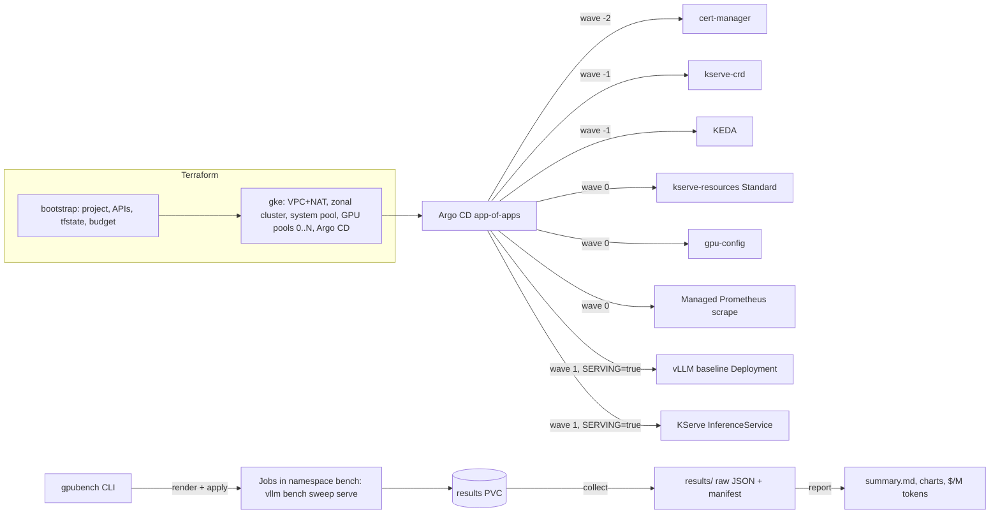

# gpu-inference-platform


GPU inference platform on GKE with a reproducible LLM serving benchmark and cost model.

**Status (2026-09):** skeleton. Infrastructure, GitOps tier and harness are in place and verified offline;
first GPU runs are scheduled for October–November 2026. Headline numbers will appear here once
`results/` contains a completed experiment.

## What this is

- Terraform for a zonal GKE Standard cluster with spot L4 / A100 node pools that scale to zero
- Argo CD app-of-apps delivering cert-manager, KServe (Standard mode), KEDA, GPU config and monitoring
- Two serving paths for the same model: a raw vLLM Deployment and a KServe InferenceService
  (an opt-in serving tier: `make up SERVING=true`)
- `gpubench`: a harness that runs vLLM's own benchmark tooling in-cluster, then computes
  cost per million tokens (peak, blended, utilization-adjusted)
- `docs/writeup.md`: what moved the numbers, what did not, and why

## Architecture



Source: `docs/diagrams/architecture.mmd`. Terraform provisions the cluster and installs Argo CD once; from
there the app-of-apps owns everything platform-side, syncing in waves (cert-manager, then the KServe CRDs
and KEDA, then KServe resources / GPU config / monitoring, then — only with `SERVING=true` — the two
serving paths). `gpubench` is
separate and downstream: it renders and applies its own Jobs into the `bench` namespace against whichever
serving path it's pointed at, then collects and reports on whatever those Jobs wrote to the results PVC.

## Layout

| Path | Purpose |
| --- | --- |
| `infra/terraform/bootstrap` | GCP project, APIs, tfstate bucket, budget alert (run once) |
| `infra/terraform/gke` | VPC, NAT, cluster, node pools, Argo CD (run per work session) |
| `platform/` | Argo CD-managed manifests and charts |
| `bench/` | `gpubench` harness, experiment definitions, price table |
| `scripts/` | one-off helpers (OpenAPI → JSON Schema conversion for `make schemas`) |
| `results/` | committed raw benchmark output and generated summaries |
| `docs/` | writeup, methodology, cost model, ADRs |
| `docs/runbooks/` | step-by-step guides: tools, GPU quota, bring-up, cost control, local rehearsal |
| `docs/diagrams/` | architecture diagram source (`architecture.mmd`) |

## Quick start

See `docs/runbooks/tools.md`, then `docs/runbooks/bring-up.md`. To rehearse the GitOps tier on
Docker Desktop's Kubernetes without GPUs or cloud costs, see `docs/runbooks/local.md`.

## Reproduce

Prerequisites (GCP auth, `terraform.tfvars`, authorized networks, GPU quota) are one-time and documented in
`docs/runbooks/bring-up.md`. Once those are done, this is the loop end to end:

```bash
make bootstrap
make up                 # or: make up SERVING=true, to also deploy the serving tier
uv run --project bench gpubench run bench/experiments/00-smoke.yaml
uv run --project bench gpubench collect bench/experiments/00-smoke.yaml -o results/$(date +%F)-smoke
uv run --project bench gpubench report results/<dir>
make down
```

`<dir>` is whatever `collect` wrote, e.g. `2026-11-03-smoke`. Swap `00-smoke.yaml` for any other file in
`bench/experiments/` to run a different experiment. The serving tier — the baseline vLLM Deployment and
the KServe `InferenceService`, needed only by `07-kserve-vs-raw` — is opt-in: `make up SERVING=true`
deploys it and keeps two L4 nodes running while the cluster is up. Run `make down` at the end of every
session — see `docs/runbooks/cost-control.md` for exactly what it does and doesn't remove.

## Experiments

Each file in `bench/experiments/` starts with a `#` comment stating the question it answers.

| # | Experiment | Kind | Question |
| --- | --- | --- | --- |
| 00 | `smoke` | engine | Does the pipeline work end to end? Tiny model, one load level, one run. |
| 01 | `baseline-l4` | engine | Baseline: Qwen3-8B-FP8 with vLLM defaults on one spot L4 across concurrency levels. |
| 02 | `quant-l4` | engine | Does quantization change latency and throughput on L4: bf16 vs FP8 vs AWQ for Qwen3-8B? |
| 03 | `kv-fp8` | engine | Does an FP8 KV cache change throughput or latency versus vLLM's automatic KV cache dtype? |
| 04 | `batching` | engine | How do vLLM's continuous-batching limits (max-num-seqs, max-num-batched-tokens) trade off throughput and latency? |
| 05 | `prefix-cache-control` | engine | Does vLLM's automatic prefix caching improve throughput and latency versus disabling it? |
| 06a | `timeslice-single` | platform | One small replica alone on a time-sliced L4: the baseline for 06b. |
| 06b | `timeslice-shared` | platform | Two small replicas time-slicing the same L4: does sharing buy throughput or only latency? |
| 07 | `kserve-vs-raw` | platform | Same model, same engine version: what does the KServe layer cost vs a raw Deployment? |
| 08 | `a100-vs-l4` | engine | Does the L4 quantization story hold on A100: how do FP8 and bf16 compare on a spot A100? |

## Verification

`make all` runs Terraform validate, Helm lint, kubeconform, pytest and ruff offline with no cloud credentials required; `make schemas` first adds strict CRD validation (KServe, KEDA, Google managed Prometheus) to the kubeconform pass.
`make local-up` brings the same Argo CD tier up on Docker Desktop's Kubernetes (no GPUs, serving
tier and Managed Prometheus scrape off) so the platform manifests are validated before a GKE session.
